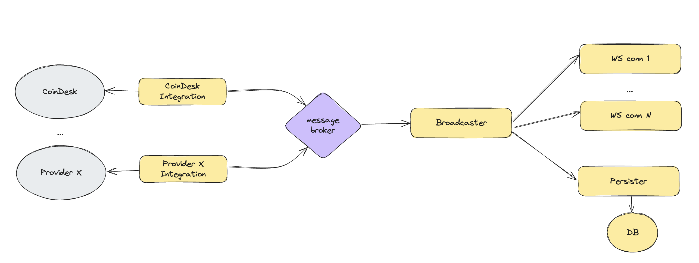
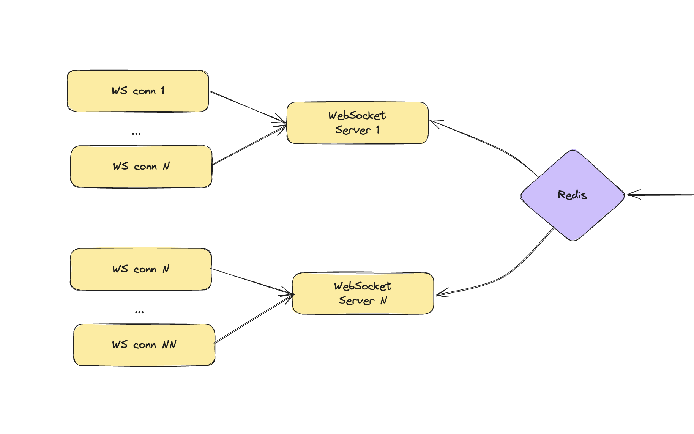

# Exchange Service

The Exchange Service is responsible for streaming real-time exchange rate updates to connected clients via WebSockets.

## How to run it

A `docker-compose.yml` file is included to run the service locally, using a mock version of the CoinDesk API (since the real one is currently unavailable).

To start the project:
```bash
make up
```

To stop the project:
```bash
make down
```

To run the unit-test:
```bash
make test-unit
```

For testing, there's a minimal `index.html` file located in the `static/` folder. When opened in a browser, it connects to the service via WebSocket and listens for exchange rate updates.

> Tip: You can pass a since query parameter to the URL to request historical data. This value will be included when establishing the WebSocket connection. For example:
> /static/index.html?since=1744280237

## Architecture

The service is designed with extensibility in mind:




It is composed of three main components:

- Exchange Providers
- Broadcaster
- Subscriptions

### Exchange providers

Each provider fetches up-to-date exchange rates from a specific external source, transforms the data into a canonical format, and publishes it to a central topic. Providers are designed to be self-contained and can be deployed in various ways:

- As Lambda functions
- As Kubernetes CronJobs
- As isolated microservices
- As part of the main service (used here for simplicity)

### Broadcaster

The Broadcaster listens for exchange rate updates from the topic and forwards them to all active subscriptions.

> For demonstration purposes, a Go channel is used as the topic. In a production environment, a more robust messaging system like Kafka or Redis Pub/Sub is recommended to:
> - Prevent data loss on service restarts
> - Enable horizontal scaling without tight coupling between pods
> - Provide message persistence (especially with Kafka)

### Subscriptions

Subscriptions consume messages from the Broadcaster and trigger actions. In this implementation, two types of subscriptions are demonstrated:

- Streaming updates to connected WebSocket clients
- Persisting updates to a data repository

## Production Readiness

To make this service production-ready, the following improvements are recommended:

- **Persistence Layer**: Use a production-grade database (e.g., TimescaleDB, MongoDB, or PostgreSQL) and use pagination for querying historical data.
- **Message Broker**: Replace in-memory channels with a robust broker such as Kafka.
- **Retry Logic**: Implement retries with exponential backoff in provider clients to handle transient errors gracefully.
- **Redundancy**: Integrate multiple exchange providers to avoid single points of failure.
- **Logging**: Implement structured logging with clear levels (error/warning/info/debug) and contextual information such as correlation IDs.
- **Metrics & Monitoring**: Track key metrics like API response times, WebSocket connection stats, error rates, and system resource usage. Use tools like Prometheus (pull-based) or DataDog (push-based).
- **Observability**: Integrate OpenTelemetry for end-to-end tracing and observability.

  
## Scalability Considerations

This application has two primary scalability vectors:

1. **Fetching Exchange Rates**: Move providers out of the main service and run them as independent, serverless functions (e.g., AWS Lambda) to scale cost-effectively.

2. **WebSocket Connections**: Offload WebSocket handling to dedicated servers that can be horizontally scaled. These servers would subscribe to exchange rate updates via a Pub/Sub mechanism (e.g., Redis).

